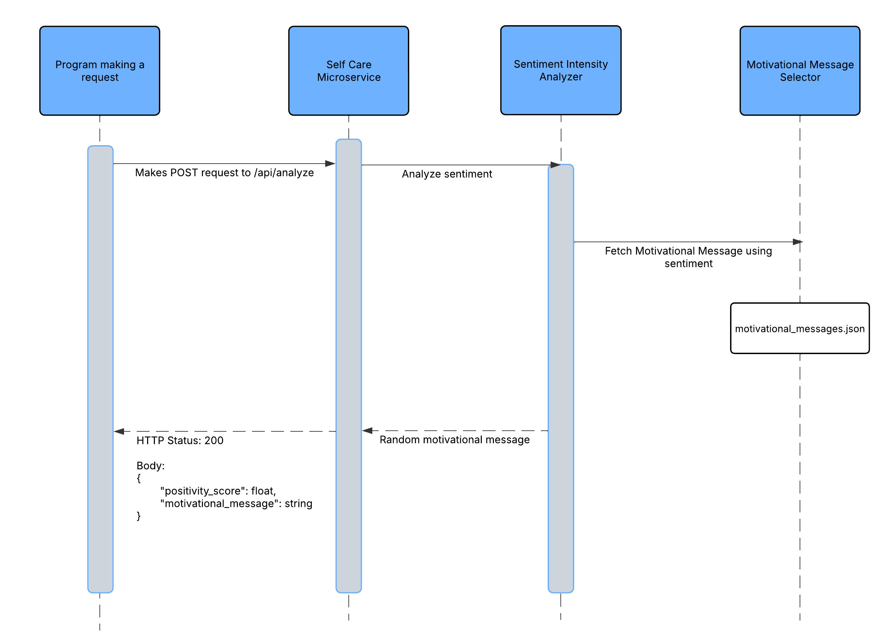

# Self Care Microservice

This microservice analyzes journal entries for sentiment and provides a motivational message based on the sentiment. It is built using FastAPI and a pre-trained sentiment analysis model.

## Setup Instructions

1. **Clone the Repository**  
   Clone this repository to your local machine.

2. **Create a Virtual Environment and Activate it**  
   Create and activate the virtual environment by running the following command in the root directory:

    ### Windows
    ```bash
    python -m venv venv
    .\venv\Scripts\activate
    ```

    ### macOS/Linux
    ```bash
    python3 -m venv venv
    source venv/bin/activate
    ```

3. **Install Python Dependencies**  
   Ensure you have Python 3.13 or higher installed. Install the required dependencies:
   ```bash
   pip install -r requirements.txt
   ```

4. **Ensure JSON File Availability**  
   Make sure `motivational_messages.json` is in the same directory as `app.py`. It contains the motivational messages used by the service.

## Starting the FastAPI Server

### With the venv activated, run:
Development environment:
```bash
uvicorn app:app --host 0.0.0.0 --port 8000 --reload
```

Production environment:
```bash
uvicorn app:app --host 0.0.0.0 --port 8000
```
The server will start on `http://0.0.0.0:8000`.

## API Usage

### POST /api/analyze

Analyze a journal entry and return a positivity score plus a motivational message.

- **Request Header**  
  `Content-Type: application/json`

- **Request Body**  
  ```json
  {
    "mood": "string",
    "journal_text": "string"
  }
  ```
  - `mood`: (optional) a string representing the user’s mood.  
  - `journal_text`: the journal entry text to analyze.

- **Response Body**  
  ```json
  {
    "positivity_score": "float",
    "motivational_message": "string"
  }
  ```

### Example with curl

```bash
curl -X POST "http://0.0.0.0:8000/api/analyze" \
  -H "Content-Type: application/json" \
  -d '{
    "mood": "neutral",
    "journal_text": "Today was challenging but I kept going."
  }'
```

**Sample Response**  
```json
{
  "positivity_score": 0.5386,
  "motivational_message": "Every setback is a setup for a comeback. Keep going!"
}
```

**HTTP Response Codes**

| Code | Meaning                                      |
|------|----------------------------------------------|
| 200  | Successful request.                          |
| 422  | Unprocessable Entity – missing or invalid fields in the request body. |
| 405  | Method Not Allowed – incorrect HTTP method used. |

## UML Diagram



## Notes

- Sentiment analysis is performed using [VADER](https://github.com/cjhutto/vaderSentiment), a lexicon‐ and rule‐based model included in the `vaderSentiment` library (no external downloads required).
- Messages are categorized into `positive`, `neutral`, and `negative` and selected at random.

## License

This project is for educational purposes. No specific license is provided.